<!-- _class: cover -->

# 📱 Hướng Dẫn Sử Dụng Hệ Thống QR Mobile

**Dành cho công nhân sản xuất**

Phiên bản 2026 · Thao tác trên điện thoại

---

<!-- _class: split -->

# 💡 Giới Thiệu

### 1. Bối cảnh & Thách thức
- 🌐 **Thị trường:** 4.0, AI, Dữ liệu số.
- 🎯 **Khách hàng:** Đòi hỏi minh bạch, **truy xuất nguồn gốc**.
- 🏭 **Nội bộ:** Giải quyết bài toán **sản lượng công nhân**.

### 2. Quyền lợi Công nhân
- 🛡️ **Bảo vệ quyền lợi:** Minh bạch, theo thời gian thực.
- 💯 **Công bằng:** Rõ ràng 100%, **không lo mất sản lượng**.

### 3. Ứng dụng phần mềm theo PDCA
- 📝 **Plan (Chuẩn bị):** Thiết lập lệnh sản xuất, quy trình và định mức trên hệ thống.
- ⚡ **Do (Thực hiện):** Công nhân thao tác số hóa, quét mã ghi nhận dữ liệu tại chuyền.
- 🔍 **Check (Kiểm tra):** QC đối chiếu dữ liệu, phần mềm tự động cảnh báo lỗi.
- 📈 **Act (Cải tiến):** Phân tích báo cáo từ hệ thống để tối ưu và tinh gọn sản xuất.

✅ <strong>Thông điệp:</strong>  
<em>"Phần mềm sẽ công bằng cho anh chị em, đồng thời là chìa khóa chinh phục khách hàng khó tính nhất."</em>

---

# Mục Lục — 4 Chức Năng Chính

  <a href="#6">
    
🟡

    <h3>Quét Cây Vải</h3>
    
Xác nhận sản xuất bằng camera hoặc mã thủ công

  </a>

  <a href="#10">
    
🟢

    <h3>Xác Nhận Tráng</h3>
    
Quét vải gốc & khai báo thành phẩm tráng mới

  </a>

  <a href="#14">
    
🔵

    <h3>Cập Nhật Tráng</h3>
    
Quét mã tráng và nhập số mét thực tế

  </a>

  <a href="#17">
    
🏭

    <h3>Nhập Kho</h3>
    
Chọn hình thức nhập và quét mã hàng

  </a>

---

# Bước 1: Đăng Nhập Hệ Thống

<ul class="steps">
  <li>1 Mở trình duyệt trên điện thoại</li>
  <li>2 Tại ô <strong>"Email hoặc Username"</strong> — gõ tên đăng nhập của bạn.</li>
  <li>3 Tại ô <strong>"Password"</strong> — gõ mật khẩu.</li>
  <li>4 Nhấn nút Đăng nhập màu xanh to bên dưới.</li>
  <li>5 Hệ thống sẽ chuyển sang màn hình <strong>Màn hình chính</strong> chính.</li>
</ul>

💡 <strong>Nếu quên mật khẩu:</strong> Nhấn vào link <strong>"Quên mật khẩu?"</strong> ở góc phải phía dưới ô mật khẩu, hoặc liên hệ bộ phận IT.

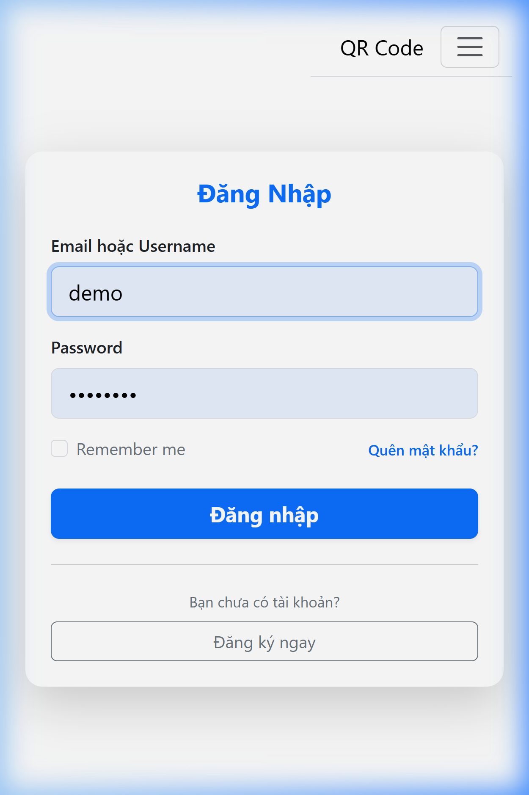

Màn hình Đăng Nhập

---

# Bước 2: Màn Hình Chính

<ul class="steps">
  <li>1 Sau khi đăng nhập, bạn thấy màn hình <strong>Bảng Điều Khiển</strong>.</li>
  <li>2 Cuộn xuống để xem các <strong>thẻ chức năng</strong> của bạn.</li>
  <li>3 Mỗi thẻ có tên chức năng và nút <strong>"Truy cập →"</strong> màu xanh bên dưới.</li>
  <li>4 Nhấn vào nút <strong>"Truy cập →"</strong> để vào chức năng tương ứng.</li>
</ul>

✅ <strong>Bạn chỉ thấy các chức năng được cấp quyền.</strong> Nếu thiếu chức năng, liên hệ quản lý để được cấp thêm quyền.

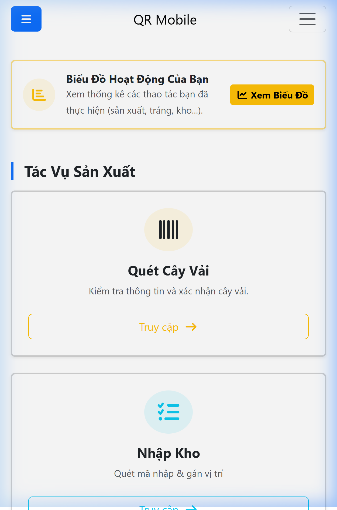

Các thẻ chức năng trên Màn hình chính

---

<!-- _class: divider scan -->

I. Quét Cây Vải

## Xác nhận sản xuất cây vải

**Mục đích:** Khi công nhân hoàn thành gia công một cây vải trên máy, dùng chức năng này để hệ thống ghi nhận.

**Ai sử dụng:** Công nhân tổ sản xuất.

---

# I — Quét Cây Vải: Vị Trí Trên Màn hình chính

<ul class="steps">
  <li>1 Trên Màn hình chính cuộn xuống.</li>
  <li>2 Tìm thẻ <strong>"Quét Cây Vải"</strong> — có biểu tượng mã vạch màu vàng.</li>
  <li>3 Nhấn nút Truy cập → màu vàng bên dưới thẻ.</li>
</ul>

💡 Nếu không thấy thẻ này, liên hệ quản lý để được cấp quyền <strong>"Quét Cây Vải"</strong>.

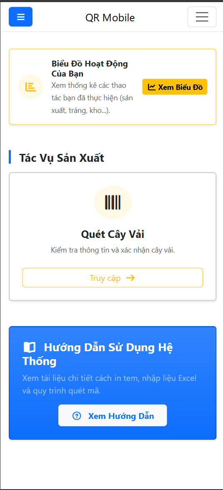

Thẻ "Quét Cây Vải" trong nhóm Tác Vụ Sản Xuất

---

# I — Quét Cây Vải: Thiết Lập Ban Đầu

<ul class="steps">
  <li>4 Phần <strong>"Thiết lập quét"</strong> xuất hiện ở đầu trang.</li>
  <li>5 Nhấn vào ô <strong>"Chọn Máy Thực Hiện"</strong> → chọn máy bạn đang sử dụng.</li>
  

   Ô <strong>"Gán Đơn Hàng (PO)"</strong> và <strong>"Gán Model"</strong>: có thể để mặc định hoặc chọn theo ca trưởng.
💡  
<strong>Thiết lập một lần mỗi ca:</strong> Hệ thống sẽ nhớ cho các lần quét tiếp theo.

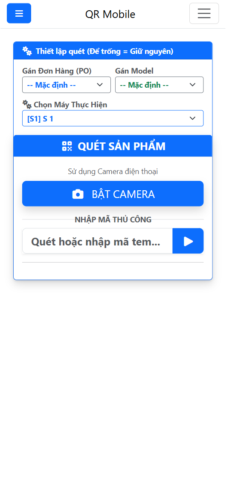

Bước thiết lập: Chọn máy và đơn hàng

---

# I — Quét Cây Vải: Quét Mã & Kết Quả

<ul class="steps">
  <li>6 Tại mục <strong>"QUÉT SẢN PHẨM"</strong>, nhấn 📷 BẬT CAMERA hoặc nhập mã tem vào ô <strong>"NHẬP MÃ THỦ CÔNG"</strong> rồi nhấn <strong>▶</strong>.</li>
  <li>7 Hệ thống tự nhận diện — hiển thị <strong>"ĐÃ XÁC NHẬN"</strong> màu xanh lá kèm thông tin: Mã Vải, Màu, Thông số.</li>
  <li>8 Nhấn  🖨️ In Lại nếu cần in lại tem.</li>
  <li>9 Nhập Số mét thực tế</li>
  <li>10 Ghi chú nếu cần, và nhấn Lưu thông tin  để hoàn thành.</li>
</ul>

✅ <strong>Thành công:</strong> Xuất hiện thông báo "Lưu thành công".

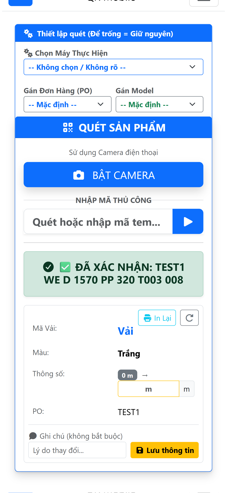

Màn hình sau khi quét thành công

---

<!-- _class: divider coat -->

II. Xác Nhận Tráng

## Tạo mã tráng mới

**Mục đích:** Sau khi tráng phủ xong một cuộn vải, dùng để khai báo thành phẩm tráng mới vào hệ thống.

**Ai sử dụng:** Công nhân tổ tráng vải.

---

# II — Xác Nhận Tráng: Vị Trí Trên Màn hình chính

<ul class="steps">
  <li>1Trên Màn hình chính cuộn xuống.</li>
  <li>2 Tìm thẻ <strong>"Xác Nhận Tráng"</strong> — có biểu tượng checklist màu xanh.</li>
  <li>3 Nhấn nút Truy cập → bên dưới thẻ.</li>
</ul>

💡 Nếu không thấy thẻ này, liên hệ quản lý để được cấp quyền <strong>"Xác Nhận Tráng"</strong>.

Cuộn xuống tìm thẻ "Xác Nhận Tráng"

---

# II — Xác Nhận Tráng: Thiết Lập

<ul class="steps">
  <li>4 Phần <strong>"Thiết lập quét"</strong> xuất hiện ở trên cùng.</li>
  <li>5 Chọn <strong>"Máy Thực Hiện"</strong> — chọn máy tráng bạn đang dùng.</li>  
   <li>6 Tại mục <strong>"QUÉT VẢI ĐỂ TRÁNG"</strong> → nhấn 📷 BẬT CAMERA hoặc nhập mã thủ công.</li>
</ul>

💡 <strong>Trạm in</strong> là máy in tem. Hỏi quản lý nếu có nhiều máy không biết chọn cái nào. 
Chọn Thành phẩm ở ô đầu tiên (ví dụ: V – Vải).

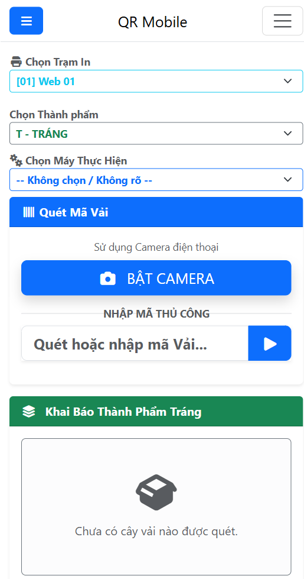

Chọn thành phẩm, máy và trạm in

---

# II — Xác Nhận Tráng: Quét & Kết Quả

<ul class="steps">  
<li>7 Nhập <strong>"Số mét vải dùng (m):"</strong>.</li>
  <li>8 Nhập <strong>"Dài tráng thành phẩm thu được"</strong>.</li>
  <li>9 Nhập <strong>"Tổng GSM Thành phẩm (Vải + Lami)"</strong>.</li>
  <li>10 Chọn <strong>"Tùy chọn xử lý Khổ Màng"</strong>.</li>
  <ul class="steps" style="margin-left: 20px;"> 
    Giữ nguyên khổ | Xén biên (Nhập khổ mới) | Chia đôi (Tạo 2 cuộn mới)
    </ul> 
  <li>11 Nhấn nút TẠO MÃ TEM TRÁNG MỚI ở dưới cùng.</li>
</ul>

Chọn <strong>"Đơn Hàng"</strong> sử dụng tùy chọn. 
💡 Khi chọn Chia đôi, hệ thống sẽ tự động tạo một tem mới cho phần vải dư ra ngoài (nếu có), giúp bạn quản lý tồn kho chính xác. 
Tự động thu hồi phần biên dư (Sinh mã Mộc mới cất kho cho dải dư khi xén / lệch khổ)

✅ <strong>Thành công:</strong> Hệ thống tạo tem tráng mới và in tự động tại trạm in đã chọn.

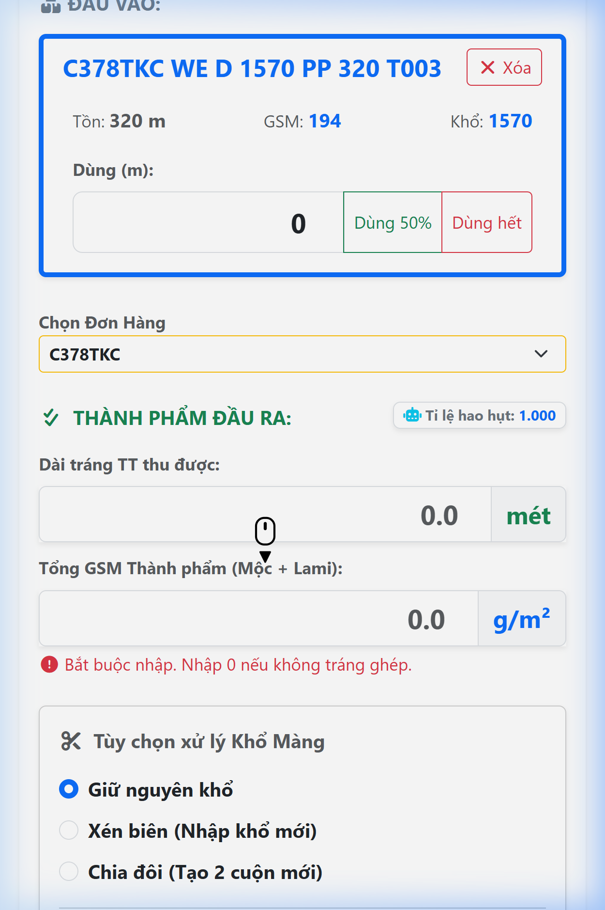

Màn hình sau khi tạo mã tem tráng thành công

---

<!-- _class: divider update -->

III. Cập Nhật Tráng

## Cập nhật số mét thực tế sau tráng

**Mục đích:** Sau khi cuộn vải tráng được đo lại, dùng chức năng này để cập nhật số mét thực tế vào hệ thống.

**Ai sử dụng:** Công nhân tổ tráng vải.

---

# III — Cập Nhật Tráng: Vị Trí Trên Màn hình chính

<ul class="steps">
  <li>1 Trên Màn hình chính cuộn xuống.</li>
  <li>2 Tìm thẻ <strong>"Cập Nhật Tráng"</strong> — có biểu tượng bút chì màu xanh dương.</li>
  <li>3 Nhấn nút Truy cập → bên dưới thẻ.</li>
</ul>

💡 Nếu không thấy thẻ này, liên hệ quản lý để được cấp quyền <strong>"Cập Nhật Tráng"</strong>.

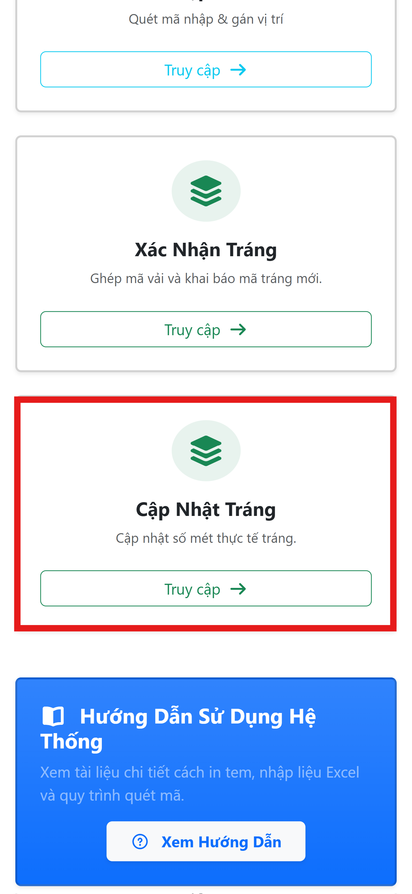

Cuộn xuống tìm thẻ "Cập Nhật Tráng"

---

# III — Cập Nhật Tráng: Quét Mã & Cập Nhật

<ul class="steps">
  <li>4 Tại mục "QUÉT MÃ CẬP NHẬT" → nhấn 📷 BẬT CAMERA hoặc nhập mã thủ công</li>
  <li>5 Kiểm tra thông tin chi tiết của mã tráng.</li>
    <li>6 Cập nhật lại <strong>GSM Thành phẩm</strong>.</li>  
  <li>7 Nhấn nút CẬP NHẬT ở dưới cùng.</li>
</ul>

💡 Chọn lại Đơn hàng cần cập nhật (nếu cần).

✅ <strong>Thành công:</strong> Thông tin số mét và GSM được cập nhật vào hệ thống.

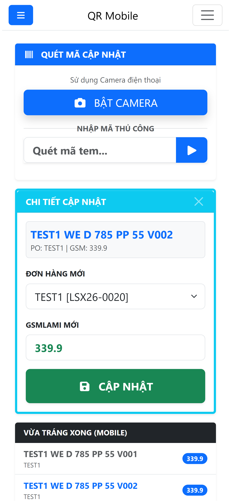

Màn hình cập nhật thông tin cuộn tráng

---

<!-- _class: divider wh -->

IV. Nhập Kho

## Quét mã hàng và gán vị trí kho

**Mục đích:** Ghi nhận hàng hóa (cuộn vải tráng) vào kho, gán vị trí kệ cụ thể.

**Ai sử dụng:** Nhân viên kho.

---

# IV — Nhập Kho: Vị Trí Trên Màn hình chính

<ul class="steps">
  <li>1 Trên Màn hình chính cuộn xuống.</li>
  <li>2 Tìm thẻ <strong>"Nhập Kho"</strong> có biểu tượng kho màu xanh ngọc.</li>
  <li>3 Nhấn nút Truy cập → bên dưới thẻ.</li>
</ul>

💡 Thẻ "Nhập Kho" thường nằm ở nhóm <strong>Kho Hàng</strong> phía dưới Màn hình chính.

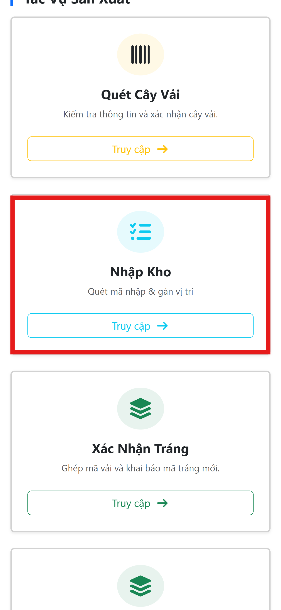

Thẻ "Nhập Kho" trong nhóm Kho Hàng

---

# IV — Nhập Kho: Chọn Hình Thức Nhập

<ul class="steps">
  <li>4 Màn hình <strong>Cấu Hình</strong> xuất hiện với 3 lựa chọn:</li>
</ul>
 
<table style="width:100%;border-collapse:collapse;font-size:0.88em;">
  <tr style="background:#0d9488;color:white;">
    <th style="padding:8px;">Lựa chọn</th>
    <th style="padding:8px;">Khi nào dùng?</th>
  </tr>
  <tr style="background:#f0fdfa;">
    <td style="padding:8px;font-weight:700;">📦 Nhập Tạm</td>
    <td style="padding:8px;">Nhập nhanh, chưa gán kệ</td>
  </tr>
  <tr style="background:white;">
    <td style="padding:8px;font-weight:700;">📍 Nhập + Vị Trí</td>
    <td style="padding:8px;">Nhập và gán kệ ngay</td>
  </tr>
  <tr style="background:#f0fdfa;">
    <td style="padding:8px;font-weight:700;">🔑 Xác Nhận Vị Trí</td>
    <td style="padding:8px;">Gán kệ cho hàng đã nhập "Tạm"</td>
  </tr>
</table>

💡 Chọn một hình thức rồi nhấn <strong>TIẾP THEO →</strong>

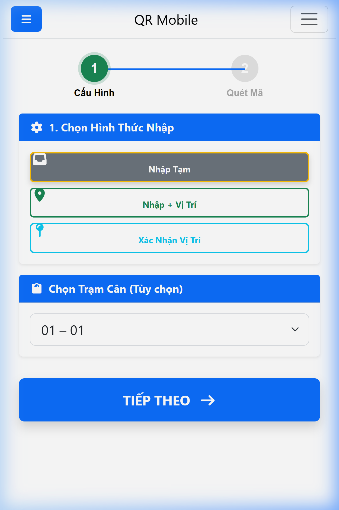

Bước 1: Chọn hình thức nhập kho

---

# IV — Nhập Kho: Cách 1 — Nhập Tạm

<ul class="steps">
  <li>1 Chọn <strong>"📦 Nhập Tạm"</strong> và nhấn <strong>TIẾP THEO →</strong>.</li>
  <li>2 Tại màn hình Quét Mã, nhấn 📷 BẬT CAMERA để quét.</li>
  <li>3 Hoặc gõ mã: <code>Code...</code> rồi nhấn <strong>▶</strong>.</li>
  <li>4 Hệ thống báo <strong>"ĐÃ NHẬP KHO"</strong> (Trạng thái Tạm).</li>
</ul>

💡 Hệ thống ghi nhận hàng vào kho nhưng chưa gán vị trí cụ thể.

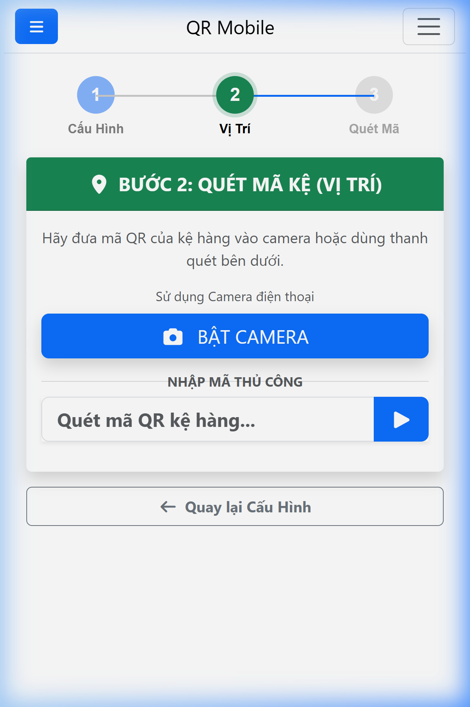

Màn hình quét mã Nhập Tạm

---

# IV — Nhập Kho: Cách 2 — Nhập + Vị Trí

<ul class="steps">
  <li>1 Chọn <strong>"📍 Nhập + Vị Trí"</strong> và nhấn <strong>TIẾP THEO →</strong>.</li>
  <li>2 <strong>Nhập vị trí:</strong> Gõ <code>Code vị trí...</code> rồi nhấn <strong>TIẾP THEO →</strong>.</li>
  <li>3 Quét hoặc gõ mã: <code>Code...</code> rồi nhấn <strong>▶</strong>.</li>
  <li>4 Hệ thống báo xác nhận đã nhập vào đúng vị trí kệ.</li>
</ul>

✅ <strong>Thành công:</strong> Hàng được gán vào kệ <code>Code...</code> ngay lập tức.

Quét mã sau khi đã gán vị trí Code...

---

# IV — Nhập Kho: Cách 3 — Xác Nhận Vị Trí

<ul class="steps">
  <li>1 Chọn <strong>"🔑 Xác Nhận Vị Trí"</strong> và nhấn <strong>TIẾP THEO →</strong>.</li>
  <li>2 <strong>Chọn vị trí:</strong> Gõ kệ đích (Ví dụ: <code>Code vị trí...</code>).</li>
  <li>3 Quét mã hàng đang ở trạng thái "Tạm": <code>Code...</code>.</li>
  <li>4 Nhấn <strong>Hoàn thành</strong> để kết thúc.</li>
</ul>

✅ <strong>Kết quả:</strong> Kiện hàng được chuyển từ kho Tạm sang vị trí Kệ chính thức.

Cập nhật vị trí kệ cho hàng tồn tạm

---

<!-- _class: split -->

# 🤝 Lắng Nghe & Cải Tiến
**Phần mềm được thiết kế để phục vụ chính công việc của anh chị!**

### Góc trao đổi:
- Thao tác bấm/quét mã trên điện thoại có **chậm hay khó dùng** không?
- Chữ và nút bấm trên màn hình có bị **nhỏ quá** không?
- Anh chị có hay bị **mất mạng, xoay vòng vòng** khi đang đứng ở chuyền không?
- Có thao tác nào làm **mất nhiều thời gian** hơn so với ghi sổ tay cũ không?

### 💡 Tinh thần hợp tác
- **Sửa lỗi:** Hệ thống mới chắc chắn cần thời gian làm quen, mong anh chị em cứ phản hồi ngay nếu thấy vướng mắc.
- **Làm chủ công nghệ:** Mỗi ý kiến khen/chê của anh chị đều giúp đội IT điều chỉnh app "mượt" và sát thực tế hơn.

✅ <strong>Tiếp nhận phản hồi:</strong> Mọi vướng mắc xin báo lại cho Quản đốc hoặc nhắn thẳng vào nhóm Zalo Hỗ Trợ IT!

---

<!-- _class: end -->

# 🙏 Hoàn Thành!
**Trao đổi hỏi đáp ghi nhận ý kiến đóng góp**
**Chúc bạn thao tác thuận lợi.**

 

📞 **Liên hệ IT hỗ trợ: 0906 585 600**

💬 **Zalo nhóm hỗ trợ:** Hỗ Trợ Hệ Thống QR

